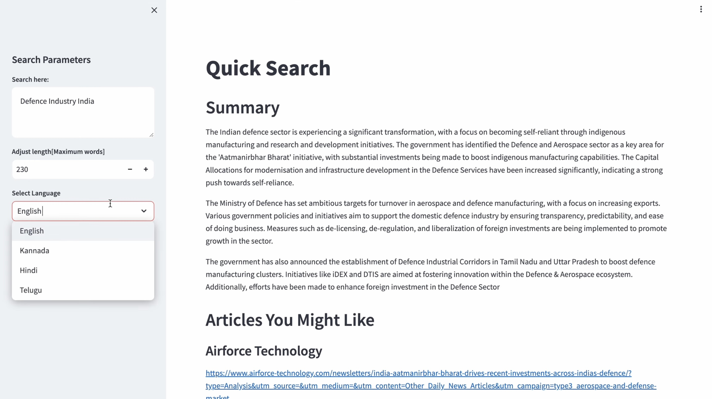
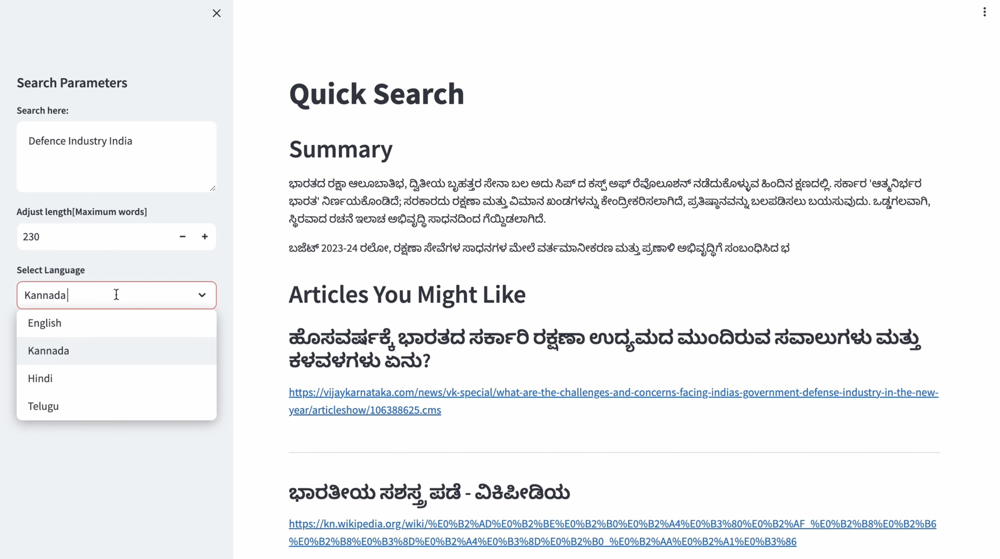

# perplexity-imitate

A Python application designed to replicate the functionality of a perplexity's search engine. Upon receiving a query from the user, it scours the internet for top articles. It selects the most relevant ones and compiles a comprehensive summary utilizing the OPENAI API. Moreover, employing the YAKE algorithm, the application extracts crucial keywords from the summary, helping in the creation of a new context. This enhanced context is then utilized for further searches, giving suggested articles to the user's query.

### Yake

YAKE! is a lightweight unsupervised automatic keyword extraction method that rests on text statistical features extracted from single documents to select the most important keywords of a text. Yake does not need to be trained on a particular set of documents, neither it depends on dictionaries, external-corpus, size of the text, language, or domain.

source: https://github.com/LIAAD/yake

### Multilingual Support

The application offers multilingual support, enabling users to conduct searches and receive summaries and articles in languages such as English, Telugu, Kannada, and Hindi. This approach increases the reach of the product and accommodates diverse linguistic preferences, enhancing the user experience.

## Samples

